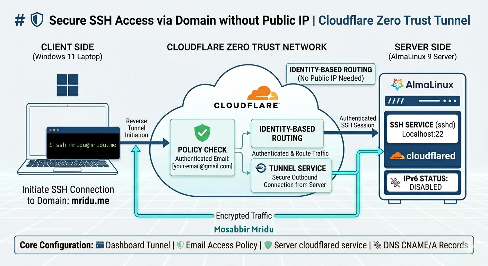

# 🛡️ Hybrid Cloud Infrastructure: Connecting Local Server to Microsoft Azure via Azure Arc

A professional implementation of **Hybrid Cloud Architecture**, demonstrating how to bridge an on-premises **AlmaLinux 10 (aaPanel)** server with **Microsoft Azure**. 
This project enables managing a local physical/virtual server directly from the Azure Portal as if it were a native Azure VM.

---

## 🚀 The Hybrid Vision
The goal of this project is to eliminate the boundary between local and cloud infrastructure. By using **Azure Arc**, we extend Azure's management and security capabilities to our local environment, creating a unified **Hybrid Cloud Control Plane**.

<p align="center">
  
</p>

---

## 🏗️ Phase-wise Azure End Configuration (The Cloud Side)

To make the hybrid connection work, the following configurations were implemented within the **Azure Portal**:

### 1. Azure Arc Resource Creation
* **Resource Type:** `Azure Arc-enabled servers`.
* **Registration Method:** Generated a **Bash deployment script** for a single server.
* **Metadata:** Assigned Tags and Resource Group (`RGmridu`) for organized management.

### 2. Log Analytics Workspace (The Telemetry Store)
* Created a **Log Analytics Workspace** to act as a central repository for the local server's performance logs and heartbeats.
* **Data Retention:** Configured retention policies to store telemetry data for monitoring.

### 3. Data Collection Rule (DCR) Configuration
* Created a **Data Collection Rule (DCR)** named `MSVMI-eastasia-aapanel`.
* **Data Sources:** Enabled **Linux Performance Counters** (CPU, Memory, Disk, Network).
* **Destination:** Linked the DCR to the Log Analytics Workspace.
* **Association:** Manually linked the DCR to the **aaPanel (Azure Arc)** resource.

### 4. Managed Identity & RBAC (The Security Layer)
This is the most critical part of the Azure-side security:
* **Server Identity:** Enabled **System-Assigned Managed Identity** for the `aaPanel` Arc resource.
* **Role Assignment (IAM):**
  * Assigned `Monitoring Metrics Publisher` role to the server identity on the Log Analytics Workspace.
* **Grafana Identity:** Assigned `Monitoring Reader` role to the `mridu-grafana-portal` managed identity at the Resource Group level.

### 5. Azure Managed Grafana Setup
* Deployed **Azure Managed Grafana** to visualize the hybrid metrics.
* **Data Source:** Connected to **Azure Monitor API**.
* **Dashboard:** Imported the `Azure Infrastructure Monitoring (Compute)` dashboard template.

---

## 🏗️ Architecture: The Hybrid Bridge
1. **Local Side:** An **aaPanel** server running on **AlmaLinux 10** (On-premises/Local Lab).
2. **The Link:** **Azure Arc (Connected Machine Agent)** creating a secure bi-directional tunnel.
3. **Cloud Side:** **Azure Portal** acting as the central management console.

---

## 🛠️ Key Implementation Steps (Server Side)

### 1. Establishing the Hybrid Link
```bash
# Connecting Local Server to Azure Arc
sudo azcmagent connect \
  --subscription-id "a4238456-bfef-4bbe-b276-6908f1274405" \
  --resource-group "RGmridu" \
  --location "eastasia" \
  --tenant-id "0d10001d-8cef-422f-b6e0-18e980120ef4" \
  --use-device-code
```

## 2. Hybrid Security: SSL/TLS Handshake Fix
Modern local servers (AlmaLinux 10) require manual tuning to maintain secure communication with Azure's hybrid endpoints:

# Solving SSL/TLS 1.3 Handshake Issues
```bash
sudo update-crypto-policies --set LEGACY
sudo systemctl restart azuremonitoragent
```
## 3. Monitoring the Hybrid Environment
Using Data Collection Rules (DCR), telemetry data from the local server is streamed to the Azure Log Analytics Workspace and visualized via Azure Managed Grafana.

## 📊 Hybrid Capabilities Enabled:
Centralized Management: Manage local server updates, policies, and security from one Azure dashboard.

Identity-based Access: No more local passwords; use Azure's Managed Identity for secure operations.

Unified Monitoring: Real-time performance tracking of local hardware on a cloud-based Grafana dashboard.

👨‍💻 Author

MD. Abdulla Al Mosabbir (Mridu)

System Engineer & Hybrid Cloud Specialist

IT Engineer at BG Group

Connect: mridu.top | GitHub: mridu4210

  
